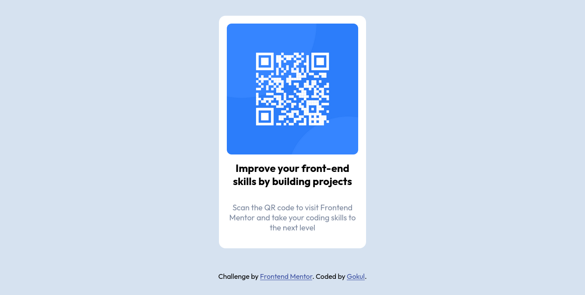

# Frontend Mentor - QR code component solution

This is a solution to the [QR code component challenge on Frontend Mentor](https://www.frontendmentor.io/challenges/qr-code-component-iux_sIO_H). Frontend Mentor challenges help you improve your coding skills by building realistic projects. 

## Table of contents

- [Overview](#overview)
  - [Screenshot](#screenshot)
  - [Links](#links)
- [My process](#my-process)
  - [Built with](#built-with)
  - [What I learned](#what-i-learned)
  - [Continued development](#continued-development)
  - [Useful resources](#useful-resources)
- [Author](#author)
- [Acknowledgments](#acknowledgments)

## Overview

### Screenshot

### Links

- Solution URL: [solution URL](https://github.com/gokul-gh/gokul-gh.github.io/tree/master/qr-code-component-main)
- Live Site URL: [live site URL](https://gokul-gh.github.io/qr-code-component-main/index.html)

## My process

### Built with

- Semantic HTML5 markup
- CSS custom properties
- Flexbox

### What I learned

Till now, I have learned html and css using mdn and some websites. Frontend Mentor is where I built first project. This project has been a challenging since I'm new to frontend projects.  Learning frontend by theory seemed to be easy but the practical implementation seems hard than I expected. While starting this project, I have no idea where to start. I was blank and it took me one day to understand what's to be done.  

### Continued development

I'm looking to develop more projects.

### Useful resources

- [MDN](https://developer.mozilla.org/en-US/docs/) - This helped me to know the values need to be used with css elements. 

## Author

- Frontend Mentor - [@gokul-gh](https://www.frontendmentor.io/profile/gokul-gh)
